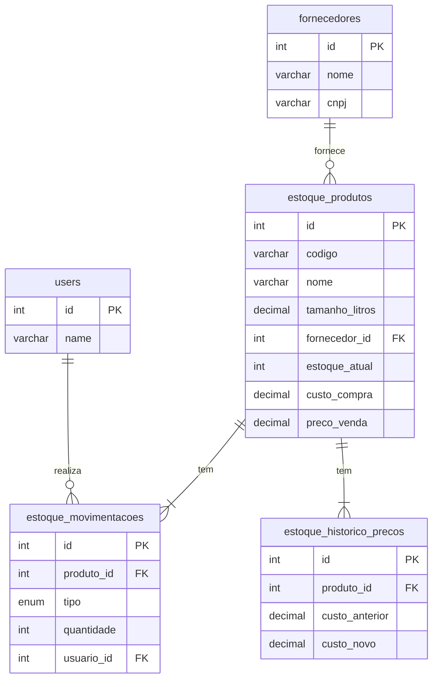

# 📦 Módulo de Gestão de Estoque - Documentação Completa

**Autor**: Manus AI  
**Versão**: 1.0  
**Data**: 2025-12-05

---

## 1. Visão Geral

O módulo de **Gestão de Estoque** foi desenvolvido para proporcionar um controle completo e automatizado sobre os barris de chopp do sistema **Chopp On Tap**. Ele permite rastrear cada barril desde a compra até o consumo, otimizando a gestão de custos, preços e reposição.

### 1.1. Funcionalidades Principais

| Funcionalidade | Descrição |
| :--- | :--- |
| **Cadastro de Produtos** | Gerenciamento completo de barris, com cálculo automático de markup e preço por 100ml. |
| **Visão de Estoque** | Dashboard com totalizadores, valores e status do estoque em tempo real. |
| **Movimentações** | Registro de entradas, saídas e ajustes, com detecção de mudança de custo. |
| **Relatórios Avançados** | Análises de movimentações, estoque crítico, histórico de preços e giro de estoque. |
| **Alertas Automáticos** | Notificações de estoque mínimo, validade próxima e ruptura. |
| **Rastreabilidade** | Controle de lote e data de validade para cada barril. |

### 1.2. Estrutura do Menu

O módulo está acessível através do menu lateral **Estoque**, com as seguintes sub-páginas:

- **Produtos**: Para cadastrar e editar os barris.
- **Visão Geral**: Para acompanhar o status do estoque.
- **Movimentações**: Para registrar entradas e saídas.
- **Relatórios**: Para análises detalhadas.

---

## 2. Guia de Uso

### 2.1. Cadastro de Produtos (Aba 1)

Nesta página, você pode cadastrar todos os tipos de barris de chopp.

**Campos Principais:**

- **Nome do Produto**: Ex: "Chopp Pilsen Artesanal"
- **Tamanho (Litros)**: 5, 10, 20, 30 ou 50 litros.
- **Custo de Compra**: Valor pago pelo barril ao fornecedor.
- **Preço de Venda**: Valor que será vendido ao consumidor final.

**Cálculos Automáticos:**

- **Markup**: O sistema calcula automaticamente a margem de lucro com base no custo e preço de venda.
- **Preço por 100ml**: O sistema calcula o preço fracionado para venda.

**Markup Livre:**

> Ao marcar a caixa **"Markup Livre"**, você pode definir a porcentagem de markup desejada, e o sistema calculará o **Preço de Venda** automaticamente.

### 2.2. Visão de Estoque (Aba 2)

Esta página é um dashboard que mostra a saúde do seu estoque em tempo real.

**Cards de Status:**

- **Produtos Cadastrados**: Total de tipos de barris.
- **Unidades em Estoque**: Soma de todos os barris.
- **Produtos Críticos**: Barris com estoque abaixo do mínimo.
- **Produtos Zerados**: Barris com estoque zerado.

**Cards de Valores:**

- **Valor Total (Custo)**: Quanto você investiu no estoque atual.
- **Valor Total (Venda)**: Potencial de faturamento do estoque atual.
- **Lucro Potencial**: Margem de lucro total do estoque.

**Barra de Progresso:**

Cada produto na tabela possui uma barra de progresso que indica visualmente o nível de estoque em relação ao máximo definido.

### 2.3. Movimentações (Aba 3)

Aqui você registra todas as entradas e saídas de barris.

**Tipos de Movimentação:**

- **Nova Entrada**: Compra de fornecedor, devolução de cliente.
- **Nova Saída**: Venda, consumo interno, perda, descarte.
- **Ajuste de Estoque**: Correção de contagem (inventário).

**Alerta de Mudança de Custo:**

> Ao registrar uma **entrada** com um **Custo Unitário** diferente do anterior, o sistema exibe um alerta informando a **variação do markup**. Isso permite que você decida se precisa ajustar o preço de venda para manter sua margem.

### 2.4. Relatórios (Aba 4)

Esta página oferece análises detalhadas para tomada de decisão.

**Tipos de Relatório:**

- **Movimentações**: Histórico completo de entradas e saídas, com filtros por data e tipo.
- **Estoque Crítico**: Lista todos os produtos que precisam de reposição, com a quantidade e o valor de investimento sugerido.
- **Histórico de Preços**: Acompanha todas as variações de custo e markup de cada produto.
- **Giro de Estoque**: Mostra os produtos mais vendidos nos últimos 30 dias, ajudando a identificar os mais populares.

---

## 3. Estrutura do Banco de Dados

O módulo utiliza 9 tabelas interligadas para garantir a integridade e performance dos dados.

| Tabela | Descrição |
| :--- | :--- |
| `fornecedores` | Cadastro de fornecedores de chopp. |
| `estoque_produtos` | Tabela principal com os dados de cada barril. |
| `estoque_movimentacoes` | Registra todas as entradas e saídas. |
| `estoque_historico_precos` | Log de todas as alterações de custo e preço. |
| `estoque_alertas` | Armazena notificações de estoque mínimo, etc. |
| `estoque_inventarios` | Para controle de contagem física. |
| `estoque_inventario_itens` | Itens contados em cada inventário. |
| `estoque_logs` | Log de todas as ações (criar, editar, excluir). |
| `vw_estoque_critico` | View para consulta rápida de produtos críticos. |
| `vw_valor_estoque` | View para cálculo rápido do valor total do estoque. |

### 3.1. Diagrama do Banco de Dados

---

## 4. Próximos Passos e Melhorias Futuras

- **Dashboard Gráfico**: Criar uma página com gráficos de pizza e barras para uma visão mais intuitiva do estoque.
- **Integração com TAPs**: Conectar o consumo das TAPs diretamente ao estoque para dar baixa automática.
- **Exportação de Relatórios**: Implementar a exportação para Excel e PDF.
- **Inventário via App**: Permitir a contagem de estoque usando a câmera do celular para ler códigos de barras.

---

**Fim da Documentação**
